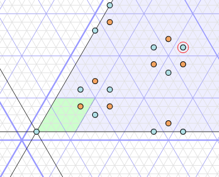
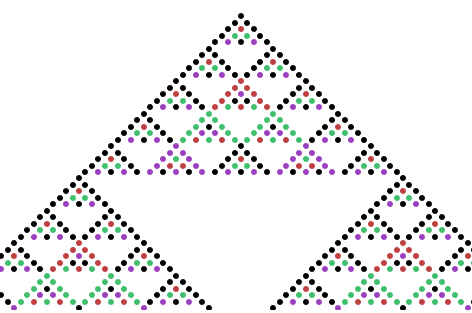

An ongoing project to make illuminating visualisations for phenomena in Lie theory. If you find this site interesting, or have suggestions and corrections, do not hesitate to [get in touch](/about.html).

## [Rank 2 representations](/rank2reps/)

A tour of the representations of rank 2 reductive groups, starting from Weyl characters and ending at simple characters in positive characteristic. Simple characters are calculated on-the-fly for almost all rank 2 groups (some are missing for $G_2$ in positive characteristic).

## [The Affine Weyl Group](/affine_weyl/)

An interactive visualisation of the affine Weyl group associated to a rank 2 Weyl group, showing various data about each group element (length, number of reduced expressions, etc). It can also calculate the *cells* and the cell ordering (by calculating the KL basis) - the figure to the right shows the right cells in Ã₂

## [Tables *Fin* and *Aff*](/tables_fin_aff/)

Table Fin contains data for the crystallographic root systems, including number of roots, order of the Weyl group, coefficients of the highest root and its dual, and the exponents of the Weyl group. Tables Aff contain further data about the affine Dynkin diagrams.

## [Affine $\SL_2$](/affine_sl2/)

A picture of the root system of Ã₂, showing the affine root system in the geometric representation, and the chamber geometry in its dual.

## [Simple $\SL_2$ characters](/simple_sl2_characters/)

The simple characters of $\SL_2$ in positive characteristic are given essentially by binomial coefficients modulo a prime. This visualisation shows the binomial coefficients modulo a prime, for any choice of prime.

## [Euclidean root systems](/euclidean_rootsystems/)

Euclidean root systems are the starting point for the combinatorics of Lie groups and Lie algebras. *This page is currently being revised*.

## [Drafts](/drafts/)

The "laboratory" of less polished work.
